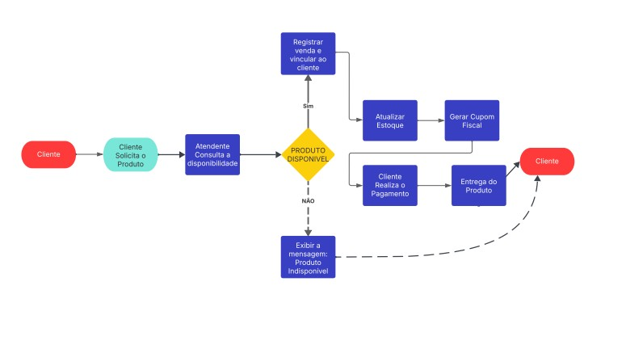
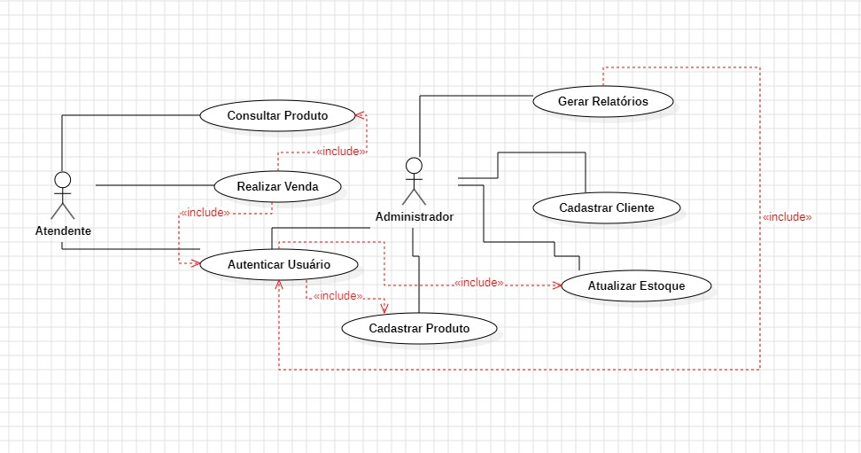

<h2><a href="https://www.mackenzie.br">Universidade Presbiteriana Mackenzie</a></h2>
<h3><a href="https://www.mackenzie.br/graduacao/sao-paulo-higienopolis/sistemas-de-informacao">Sistemas de Informação</a></h3>

*Sistema de Gestão da Farmácia Vida Saudável*

**Conteúdo**

- [Autores](#autores)
- [Descrição do Projeto](#descrição-do-projeto)
- [Análise de Requisitos Funcionais e Não-Funcionais](#análise-de-requisitos-funcionais-e-não-funcionais)
- [Diagrama de Atividades](#diagrama-de-atividades) 
- [Diagrama de Casos de Uso](#diagrama-de-casos-de-uso)
- [Descrição dos Casos de Uso](#descrição-dos-casos-de-uso)
- [Diagrama de Sequência](#diagrama-de-sequência)
- [Diagrama de Classes](#diagrama-de-classes)
- [Diagrama de Estados](#diagrama-de-estados)
- [Diagrama de Implantação](#diagrama-de-implantação)
- [Referências](#referências)

---

# Autores

* LUCAS ZEFERINO BARACAT 10396267

---

# Descrição do Projeto

Esse projeto tem como foco criar um sistema simples e eficiente para ajudar na organização da **Farmácia Vida Saudável**, que fica em Santos-SP. A farmácia está crescendo e precisa sair do papel e das planilhas, passando a usar um sistema informatizado que facilite o dia a dia dos funcionários.

O sistema vai permitir cadastrar medicamentos e clientes, registrar vendas, controlar o estoque de forma automática e emitir relatórios. Além disso, terá controle de acesso com perfis diferentes para **atendentes** e **administradores**, garantindo que cada um tenha acesso só ao que precisa. A ideia é tornar o atendimento mais rápido, evitar erros e ajudar o dono da farmácia a ter mais controle sobre o negócio.

---

# Análise de Requisitos Funcionais e Não-Funcionais

Fase I - Análise de Requisitos
**Requisitos Funcionais**
1. Cadastro de medicamentos com nome, descrição, fabricante, lote, validade, quantidade e preço. 2. Cadastro de clientes com nome, CPF, telefone e histórico de compras.
3. Consulta de produtos disponíveis no estoque.
4. Realização de vendas, vinculadas a um cliente.
5. Geração de cupom fiscal a cada venda.
6. Atualização automática do estoque após cada venda.
7. Emissão de alerta para estoque baixo.
8. Geração de relatórios de vendas (diário, semanal, mensal).
9. Geração de relatórios dos produtos mais vendidos.
10. Geração de relatórios de clientes mais frequentes.
11. Autenticação de usuários com perfis distintos.
12. Permissões específicas para administradores: cadastrar produtos/clientes, gerar relatórios e consultar histórico.
**Requisitos Não Funcionais**
1. Interface gráfica amigável e de fácil uso.
2. Disponibilidade em rede local para múltiplos usuários.
3. Segurança via login e senha.
4. Compatibilidade com impressoras de cupom térmico.
5. Backup automático semanal do banco de dados.
6. Tempo de resposta inferior a 2 segundos para consultas e cadastros. 7. Utilização de banco de dados relacional.
**Atores do Sistema**
- Atendente: realiza vendas e consulta produtos.
- Administrador: cadastra produtos/clientes, gera relatórios e acessa o histórico completo.
**Fluxo Típico do Sistema**
1. Cliente solicita medicamento.
2. Atendente consulta disponibilidade.
3. Se disponível, registra venda vinculando ao CPF do cliente.
4. Sistema atualiza o estoque e gera cupom fiscal.
5. Cliente realiza o pagamento e recebe o produto.
6. Administrador acessa os relatórios quando necessário.

PDF da Fase I: [fase1.pdf](./fase1.pdf)

---

# Diagrama de Atividades

---

# Diagrama de Casos de Uso

---

# Descrição dos Casos de Uso

Fase IV - Descrição dos Casos de Uso
1. **Autenticar Usuário**
Atores: Atendente, Administrador
Descrição: Permite que o usuário entre no sistema com login e senha. Fluxo Principal:
1. Usuário informa login e senha.
2. Sistema verifica credenciais.
3. Se válidas, acesso é concedido com base no perfil.
Fluxo Alternativo:
- 3a. Se dados inválidos, exibir mensagem e solicitar nova tentativa.
Pré-condição: Sistema deve estar iniciado.
Pós-condição: Usuário autenticado e redirecionado ao menu principal.
2. **Consultar Produto**
Atores: Atendente
Descrição: Permite verificar se um produto está disponível no estoque. Fluxo Principal:
1. Atendente acessa a opção 'Consultar Produto'.
2. Digita nome ou código do produto.
3. Sistema exibe informações e quantidade disponível.
Fluxo Alternativo:
- 3a. Produto não encontrado -> exibe mensagem de erro.
3. **Realizar Venda**
Atores: Atendente
Descrição: Registra a venda de produtos para um cliente. Fluxo Principal:
1. Atendente autentica-se.
2. Consulta o(s) produto(s) no sistema.
3. Seleciona o cliente (ou realiza cadastro rápido). 4. Adiciona itens à venda.
5. Finaliza a venda.
6. Sistema atualiza estoque e gera cupom fiscal.
Fluxo Alternativo:
- 2a. Produto fora de estoque -> exibe aviso e bloqueia venda. - 3a. Cliente não encontrado -> opção de novo cadastro.
4. **Cadastrar Produto**
Atores: Administrador
Descrição: Permite o registro de novos produtos e medicamentos. Fluxo Principal:
1. Administrador autentica-se.
2. Acessa tela de cadastro de produto.
3. Preenche dados: nome, descrição, fabricante, lote, validade, estoque, preço. 4. Confirma cadastro.
Fluxo Alternativo:
- 3a. Dados inválidos ou em branco -> sistema solicita correção.
5. **Cadastrar Cliente**
Atores: Administrador
Descrição: Permite o registro de clientes. Fluxo Principal:
1. Administrador autentica-se.
2. Acessa tela de cadastro de cliente. 3. Preenche nome, CPF e telefone. 4. Confirma cadastro.
Fluxo Alternativo:
- 3a. CPF já cadastrado -> sistema impede duplicação.
6. **Atualizar Estoque**
Atores: Administrador
Descrição: Ajusta a quantidade de produtos no estoque. Fluxo Principal:
1. Administrador autentica-se.
2. Acessa a tela de controle de estoque.
3. Seleciona o produto.
4. Altera a quantidade manualmente. Pós-condição: Estoque atualizado corretamente.
7. **Gerar Relatórios**
Atores: Administrador
Descrição: Permite visualizar relatórios gerenciais. Fluxo Principal:
1. Administrador autentica-se.
2. Acessa a opção de relatórios.
3. Escolhe o tipo de relatório: diário, semanal, mensal, produtos mais vendidos, clientes frequentes. 4. Sistema gera o relatório solicitado.
Fluxo Alternativo:
- 3a. Nenhum dado para o período -> sistema informa ausência de dados.

PDF da Fase IV: [fase4.pdf](./fase4.pdf)

---

# Referências
- 
- Material de Engenharia de Software
